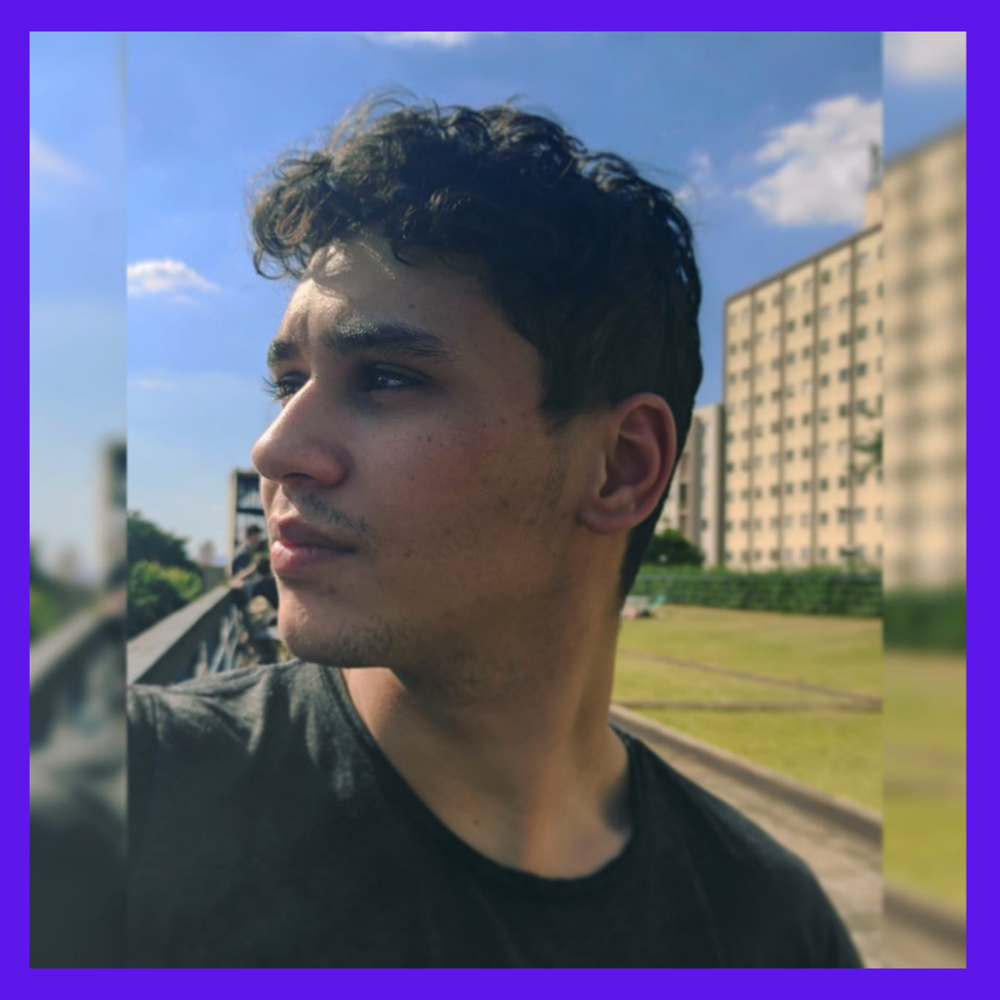

  <!-- Header -->
  
  <!-- Introduction: It´s me -->

  ---
 
  
  ---

  <!-- Texto de preferência -->
  
 
        

              
        

  
            - 🔭 I’m currently working as a Freelancer!
            - 🌱 I’m learning NodeJs and ReactJs
            - 👯 I'm looking to collaborate with other developers.
            - ⚡ Fun fact: I love draw manga
            
             
            >P.S. I do know that HTML is not a programming language!<
              
  

  ---
  
  ---

  

     

      👩‍💻 I am working on:
  
       ◈Construction projects and my portfolio website 
       ◈Bootcamp Inter 
       ◈Introduction to Computer Science  
        Harvard(CC50), "Fundação Estudar"
  
  

   
  ---
  
  ---

  <!-- coleaqui -->
  
  

  

      
  

    
    <skills nvl>
          <html> intermediate </html>
          <css> intermediate </css>
          <javascript> intermediate </javascript>
     </skills nvl>
   
  

  
  <!-- /coleaqui -->

---
    
---

  
 
    

      
    
      💡 Goals for 2022
      
      ◈ My webisite up 
      ◈ Complete Bootcamp 
      ◈ Creat 5 projetos
   
      
   
   
   
    
      
  ---

  ---

<!-- Icons_habilidades -->
  

      <!-- For more icons please follow  https://github.com/MikeCodesDotNET/ColoredBadges -->
      
      
      
      
      
  

<!-- /Icons_habilidades -->

  ---

<!--   Edit_tags_card-->
<!--    -->
<!--  /Edit_tags_card  -->
  
  ---
 
<!-- Social_midia_icon_link -->
  

    
    
    
     
  

<!-- /Social_midia_icon_link -->

  

<!-- &theme=radical -->
